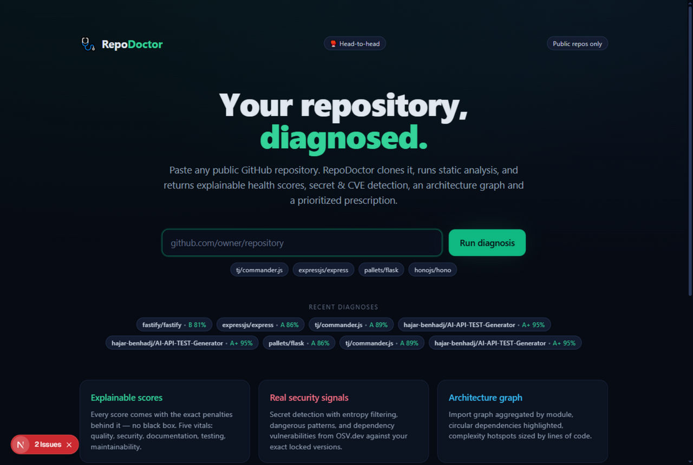
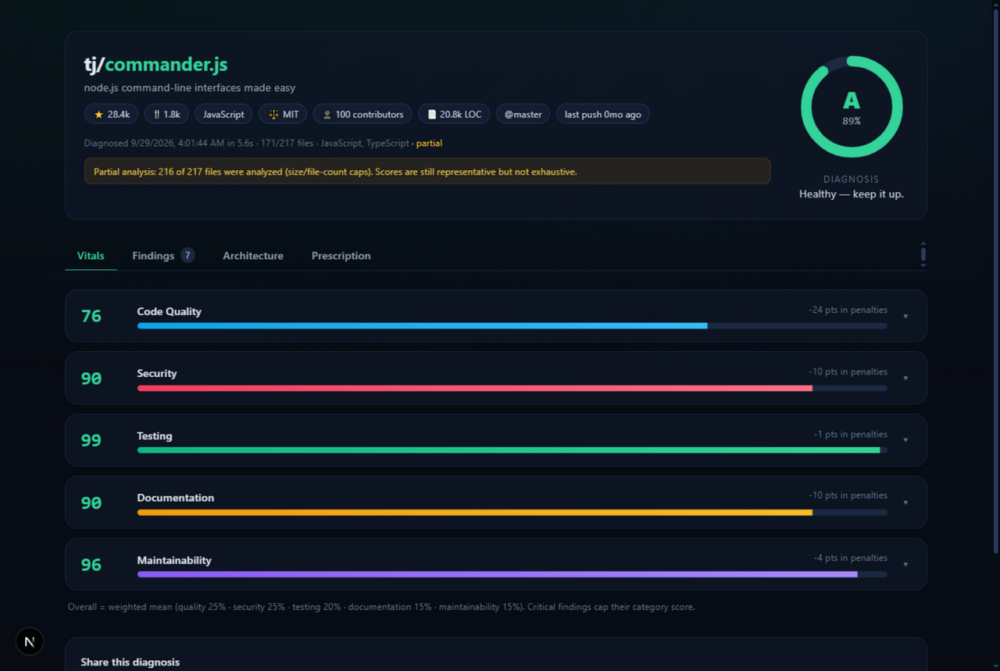
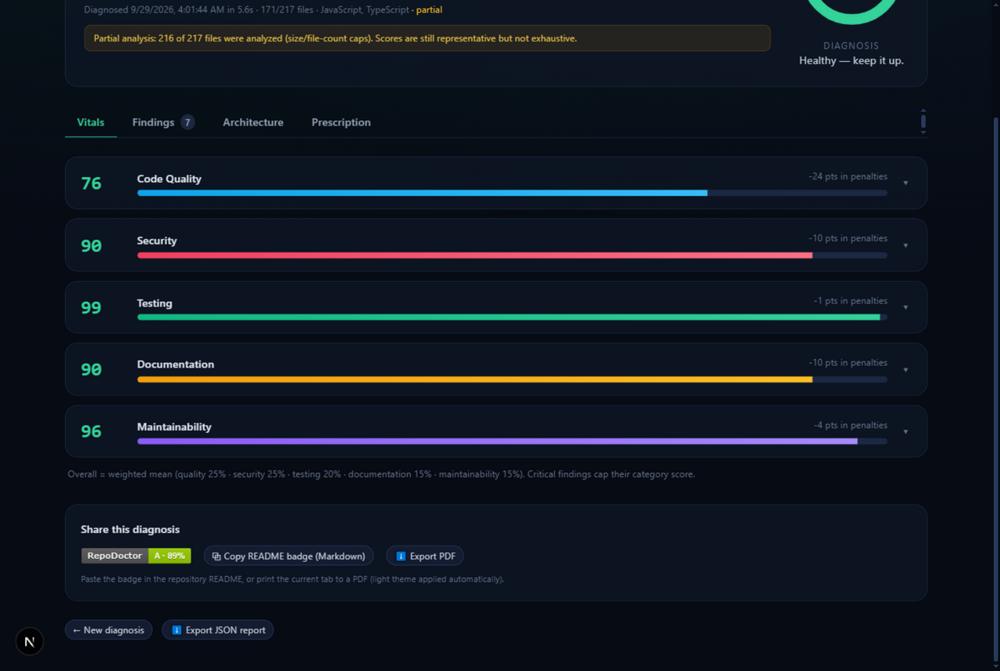
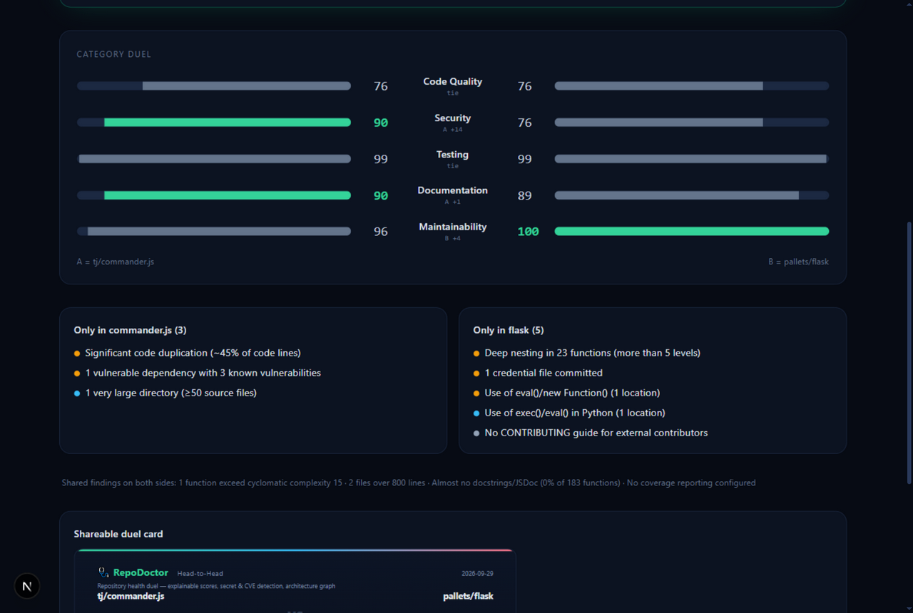
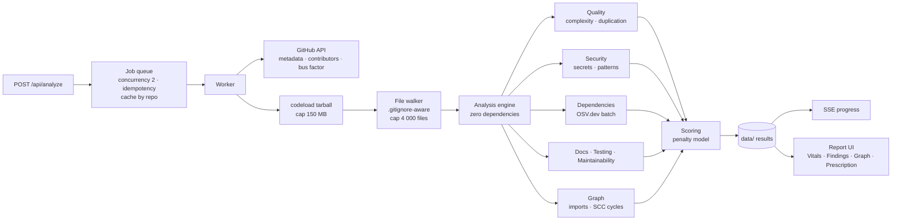

<div align="center">

# 🩺 RepoDoctor

### Your repository, diagnosed.

**Paste a public GitHub repository → get explainable health scores, secret & CVE detection,
an architecture graph with cycle detection, and a prioritized prescription.**

[](https://nextjs.org)
[](https://www.typescriptlang.org)
[](#-architecture)
[](LICENSE)
[](#-tests)

[Features](#-what-it-does) · [How scoring works](#-how-scoring-works-transparent-by-design) · [Quick start](#-quick-start) · [API](#-api) · [Roadmap](#-roadmap)



</div>

---

## ✨ What it does

RepoDoctor is a full-stack static-analysis tool — not another GitHub dashboard. It clones a
repository, runs a dependency-free analysis engine over every source file, and produces a
**medical report for your codebase**: vitals, diagnosis, and prescription.

| | |
|---|---|
| 🔍 **Explainable scores** | Every score ships with the exact penalties behind it. Click `43%` and see *why* — no black box, no vibes. |
| 🔐 **Real security signals** | 12 secret patterns with entropy + placeholder filtering, committed credential files (`.env`, `.pem`, `.tfstate`…), and 9 dangerous code patterns (`eval`, `shell=True`, `verify=False`, TLS bypass…). |
| 📦 **Dependency CVEs** | Parses 8 lockfile formats and queries [OSV.dev](https://osv.dev) against your **exact locked versions** — the same CVE database powering GitHub's own advisory data. |
| 🧭 **Architecture graph** | JS/TS + Python import graph, aggregated by module, with Tarjan SCC **cycle detection**, fan-in hotspots and external-dependency mapping — rendered by a hand-rolled force layout, zero graph libraries. |
| 🥊 **Head-to-Head** | Put two repositories in the ring: mirrored category bars, a winner per vital, unique-findings diff, and a shareable duel card. Rematches are instant thanks to result caching. |
| 🩹 **Prescription** | Every finding maps to an action with *impact × effort* ranking — the plan works with zero configuration; an optional LLM layer turns it into a written narrative. |
| 🏷️ **Shareable output** | shields-style SVG badge, full duel card as SVG, one-click PDF export via a print stylesheet, JSON export of the raw report. |

## 🩺 The report



**Five vitals, each fully explainable:**

| Vital | What it actually measures |
|---|---|
| **Code Quality** | Cyclomatic complexity per function (branch-point approximation), deep nesting, god files, cross-file duplication, comment density |
| **Security** | Committed secrets (entropy-scored), credential files, dangerous patterns, and dependency vulnerabilities from OSV.dev |
| **Testing** | Test-to-code ratio curve, whether CI *actually runs tests*, coverage tooling, e2e presence |
| **Documentation** | README depth + required sections, LICENSE, docstring/JSDoc coverage from the AST, comment density |
| **Maintainability** | Linter/formatter hygiene, TODO debt per kLOC, bus factor, dependency weight, oversized directories |



> Every category can be expanded to the exact list of penalties that moved it — including a
> critical-findings cap and a test-ratio curve, so the number is honest about what it knows
> and what it sampled (`171/217 files · partial`).

## 🥊 Head-to-Head

Put two repos in the ring — `express vs fastify`, `flask vs starlette`, or any pairing:



Each duel generates a **shareable SVG card** for your README:

```markdown
[](https://your-host/compare?a=<idA>&b=<idB>)
```

## 🧠 How scoring works (transparent by design)

1. Every finding carries a severity-based penalty: `critical 30 · major 10 · minor 4 · info 1`.
2. `category score = 100 − Σ penalties`, with two honesty mechanisms:
   - any **critical** finding caps the category at 55 (35 for two or more);
   - **Testing** is scored on a test-to-code ratio curve (target ≥ 60%) with CI penalties on top.
3. `overall = weighted mean` — quality 25% · security 25% · testing 20% · documentation 15% · maintainability 15% — mapped to grades **A+ → F**.
4. Confidence is reported: files sampled, languages covered, and a `partial` flag when caps kicked in.

## 🏗️ Architecture



The heart of the project is [`lib/analyzer/`](lib/analyzer) — a **zero-dependency** TypeScript
engine: a comment/string-stripping state machine (template literals, triple-quoted strings,
regex-literal disambiguation) feeds heuristic parsers (brace matching for JS/TS, indentation
scopes for Python) that approximate cyclomatic complexity, detect clones with a sliding
7-line window, and resolve imports into a module graph that Tarjan's algorithm sweeps for cycles.

**Limits & safety** — archive ≤ 150 MB, ≤ 4 000 files, ≤ 400 KB/file, ≤ 60 MB of text; timeouts on
every stage; results cached per repo for 24 h; only derived metrics are stored, never source code.

## 🚀 Quick start

```bash
git clone https://github.com/<you>/repodoctor
cd repodoctor
npm install
npm run dev          # → http://localhost:3000
```

Optional environment (`.env.local`):

| Variable | Effect |
|---|---|
| `GITHUB_TOKEN` | Raises the GitHub API limit from 60 to 5 000 req/hour |
| `OPENAI_API_KEY` · `ANTHROPIC_API_KEY` · `GEMINI_API_KEY` | Enables the AI-written prescription (optional — everything works without it) |

## 🖥️ Usage

```bash
# Web
npm run dev                       # paste a URL, or open /compare for a duel

# CLI
npm run analyze -- https://github.com/owner/repo [--token=ghp_xxx]

# Offline selftest (21 seeded issues in a deliberately unhealthy fixture repo)
npm run selftest
```

**Badge** in your README:

```markdown
[](https://your-host/analysis/<analysis-id>)
```

## 🔌 API

| Route | Description |
|---|---|
| `POST /api/analyze` `{url}` | Enqueue an analysis → `202 {job}` |
| `GET /api/analyze/:id` | Job status (+ full result when done) |
| `GET /api/analyze/:id/events` | SSE progress stream |
| `POST /api/analyze/:id/prescribe` | LLM prescription (graceful fallback without a key) |
| `POST /api/compare` `{a, b}` | Enqueue both sides of a duel |
| `GET /api/analyses` | Recent diagnoses |
| `GET /api/badge/:id` | SVG badge (accepts result id or job id) |
| `GET /api/card?a=<id>&b=<id>` | Head-to-Head duel card as SVG |

## 📂 Project structure

```
repodoctor/
├── app/
│   ├── api/                    # analyze · events (SSE) · compare · badge · card · prescribe
│   ├── analysis/[id]/          # live progress + full report
│   ├── compare/                # head-to-head duels
│   ├── components/             # report views, graph, duel client, progress
│   └── page.tsx                # landing
├── lib/
│   ├── analyzer/               # ⭐ the engine — zero dependencies
│   │   ├── text.ts             #   comment/string-stripping state machine
│   │   ├── quality.ts          #   complexity, nesting, duplication
│   │   ├── security.ts         #   secrets, credential files, dangerous patterns
│   │   ├── deps.ts             #   8 lockfile parsers → OSV.dev querybatch
│   │   ├── docs.ts             #   README, license, docstrings
│   │   ├── testing.ts          #   ratio, CI, coverage, e2e
│   │   ├── maintainability.ts  #   hygiene, TODO debt, bus factor
│   │   ├── graph.ts            #   import graph, module aggregation, Tarjan SCC
│   │   ├── score.ts            #   penalty model + prescription builder
│   │   └── index.ts            #   pipeline orchestration
│   ├── github.ts               # API + tarball downloader with caps
│   ├── queue.ts                # in-process job manager (BullMQ-ready)
│   ├── store.ts                # JSON persistence (Postgres-ready)
│   └── types.ts                # shared contracts
├── fixtures/sample-repo/       # deliberately unhealthy repo for the selftest
├── scripts/                    # analyze-cli.ts · selftest.ts
└── docs/screenshots/
```

## 🧪 Tests

The engine is covered by an offline selftest that runs against
[`fixtures/sample-repo`](fixtures/sample-repo) — a fixture with 21 seeded issues
(committed AWS example key, `eval()`, `shell=True`, a duplicated module, a missing lockfile…)
and asserts each one is caught:

```bash
npm run selftest
# ✅ All checks passed — the fixture scores 49/100 (F), exactly as it should
```

## 🛣️ Roadmap

- [ ] Watch mode — GitHub webhook re-analysis + score history (needs auth + Postgres)
- [ ] Go / Java / Rust support via tree-sitter grammars
- [ ] Redis/BullMQ queue driver for horizontal scaling
- [ ] og-image generation for social sharing
- [ ] Multi-repo portfolio view ("diagnose all my repos")

## 🤝 Contributing

Issues and PRs are welcome. The engine is deliberately dependency-free — new analyzers should
follow the `Finding` contract in [`lib/types.ts`](lib/types.ts) and register penalties in
[`lib/analyzer/score.ts`](lib/analyzer/score.ts).

## 📄 License

[MIT](LICENSE) © 2026 Hajar Benhadj

---

<div align="center">
<sub>Built with Next.js 15, TypeScript and an unreasonable amount of regular expressions.</sub>
</div>
